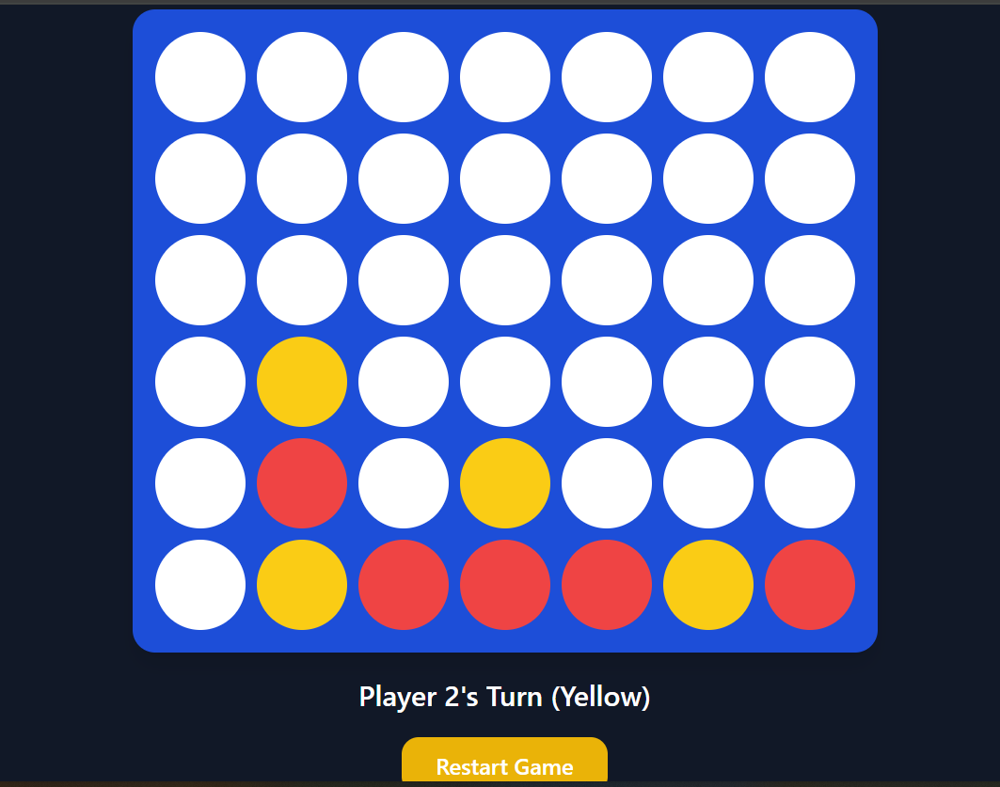

# 🎮 Connect 4 Game

A simple, clean, and responsive **Connect 4** game built using:

- **HTML** for structure
- **Tailwind CSS** for styling
- **Vanilla JavaScript** for game logic



---

## 🚀 Features

- 🔴🟡 Two-player gameplay (local)
- 🎯 Click-based column moves
- 🧠 Win detection:
  - Horizontal
  - Vertical
  - Diagonal (both directions)
- 🤝 Draw detection
- 🔄 Restart game button
- 📱 Responsive design (mobile-friendly)
- 🎨 Styled with Tailwind CSS

---

## 🛠️ Setup & Usage

1. **Clone the repository**
   ```bash
   git clone https://github.com/thanos14million605/Connect4.git
   ```

Navigate into the project folder

cd Connect4
Open the game
Simply open index.html in your browser
🎮 How to Play
Players take turns clicking a column
The disc drops to the lowest available slot
First player to connect 4 discs in a row wins:
Horizontally
Vertically
Diagonally
If the board fills up, it's a draw
🎨 Tech Stack
HTML5
Tailwind CSS (via CDN)
JavaScript (ES6)
👨‍💻 Author

Built with ❤️ by Ebrima Gajaga

⭐ Support

If you like this project, consider giving it a star ⭐ on GitHub!

---
